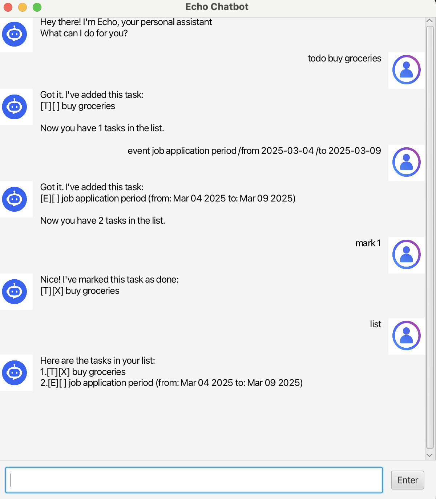

# Echo User Guide



Echo is a simple and efficient task management chatbot that helps you keep track of your todos, deadlines and events.  
It provides clear commands and instant feedback, allowing you to organise your tasks quickly and effectively.

---

## Adding todos

Adds a simple task without any date or time.

Example: `todo finish homework`

Echo will add the task to the list and show the updated number of tasks.

```
Got it. I've added this task:
[T][ ] finish homework
Now you have 1 tasks in the list.
```

---

## Adding deadlines

Adds a task with a specified due date.

Example: `deadline submit assignment /by 2026-03-30`

Echo will store the deadline and display it in a readable date format.

```
Got it. I've added this task:
[D][ ] submit assignment (Mar 30 2026)
Now you have 2 tasks in the list.
```

If the date format cannot be parsed, Echo will still store it as plain text and display a warning.

---

## Adding events

Adds a task with a start and end date.

Example: `event hackathon /from 2026-04-01 /to 2026-04-02`

Echo will store both dates and display the event duration.

```
Got it. I've added this task:
[E][ ] hackathon (from: Apr 01 2026 to: Apr 02 2026)
Now you have 3 tasks in the list.
```

---

## Listing tasks

Displays all tasks currently stored.

Example: `list`

Echo will show all tasks in a numbered list.

```
Here are the tasks in your list:
1.[T][ ] finish homework
2.[D][ ] submit assignment (Mar 30 2026)
3.[E][ ] hackathon (from: Apr 01 2026 to: Apr 02 2026)
```

---

## Marking tasks

Marks a task as completed.

Example: `mark 1`

Echo will update the task status to done.

```
Nice! I've marked this task as done:
[T][X] finish homework
```

---

## Unmarking tasks

Marks a task as not completed.

Example: `unmark 1`

Echo will update the task status to not done.

```
OK, I've marked this task as not done yet:
[T][ ] finish homework
```

---

## Deleting tasks

Removes a task from the list.

Example: `delete 2`

Echo will remove the task and update the task count.

```
Noted. I've removed this task:
[D][ ] submit assignment (Mar 30 2026)
Now you have 2 tasks in the list.
```

---

## Finding tasks

Searches for tasks containing a keyword.

Example: `find assignment`

Echo will display all matching tasks.

```
Here are the matching tasks in your list:
1.[D][ ] submit assignment (Mar 30 2026)
```

If no tasks match the keyword:

```
No matching tasks found.
```

---

## Updating tasks

Updates the description or date of an existing task.

### Updating description

Example: `update 1 finish math homework`

Echo will replace the task description with the new one.

```
Got it. I've updated this task:
[T][ ] finish math homework
```

---

### Updating deadline

Example: `update 2 /by 2026-04-01`

Echo will update the deadline date.

```
Got it. I've updated this task:
[D][ ] submit assignment (Apr 01 2026)
```

---

### Updating event

Example: `update 3 /from 2026-04-05 /to 2026-04-06`

Echo will update both the start and end dates.

```
Got it. I've updated this task:
[E][ ] hackathon (from: Apr 05 2026 to: Apr 06 2026)
```

Only deadlines support `/by`, and only events support `/from` and `/to`.

---

## Getting a cheer

Displays a random motivational message.

Example: `cheer`

Echo will retrieve and display a random quote from the cheer file.

```
Keep going — you're closer than you think.
```

---

## Exiting the program

Closes the application.

Example: `bye`

Echo will terminate the session.

```
Bye!
```

---

## Error handling

Echo provides clear error messages for invalid inputs.

Example errors:

```
Error: Task number must be a number!
Error: That task number does not exist!
Error: The description of a todo cannot be empty.
Error: I don't understand that command.
```

---

## Storage

Echo automatically saves tasks to a file and loads them when the program starts.

Tasks are stored in:

```
data/tasks.txt
```

This ensures your data persists across sessions.

---

## GUI Overview

Echo uses a JavaFX graphical interface that includes:

- A chat display area for conversation
- A text input field for commands
- A send button for submitting input
- Message bubbles for user and Echo responses

The interface updates in real time as you interact with Echo.

---

Enjoy using Echo to manage your tasks efficiently!